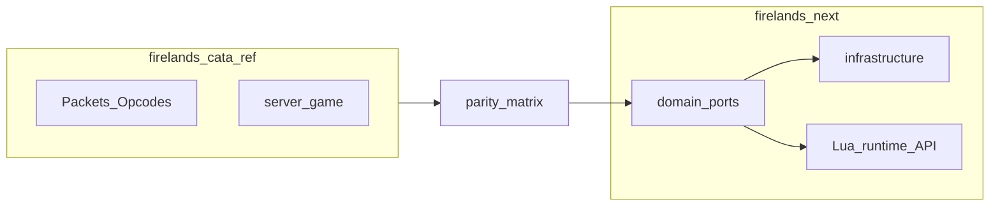

# Paridad con firelands-cata-ref y scripting en Lua

Documento vivo para **seguimiento**: enlaza el roadmap de alto nivel con tareas concretas y el estado (hecho / pendiente). Actualizarlo al cerrar PRs o hitos.

**Relacionado:** [implementation_plan.md](../implementation_plan.md) (fases 1–6 del emulador), [parity_matrix.md](parity_matrix.md) (matriz subsistema × ref × estado), [CLIENT_STABILITY.md](CLIENT_STABILITY.md) (prioridad cliente estable). Este archivo amplía la visión hacia **paridad con el core de referencia** y la decisión de **Lua** en lugar de lógica tipo Smart Scripts en base de datos.

---

## Seguimiento rápido (actualizar al avanzar)

### Hitos del plan “paridad + Lua”

| ID | Hito | Estado |
|----|------|--------|
| parity-matrix | Matriz de paridad (subsistema × ref × componente next × criterio de hecho) | Hecho (`docs/parity_matrix.md`) |
| lua-foundation | Lua 5.4 en CMake (walterschell), `infrastructure/scripting`, puerto `IGameScriptHost`, tests del bridge. *Bridge con API C de Lua; sol2 posible más adelante por compatibilidad libc++.* | Primera iteración hecha |
| world-core-gap | Cerrar gaps fase 5–6 (opcodes / mundo vacío / broadcast) vs ref | Parcial hecho: gossip opcodes, SAY/YELL nearby, movimiento con filtro opcode, `player_login` → Lua |
| entities-combat | Creature/GO en dominio + combate/hechizos mínimos + hooks Lua | Dominio Creature/GO + test Map; combate pendiente |
| maps-collision | mmap/vmap y APIs de colisión alineadas al ref | Puerto `IMapCollisionQueries` + stub + config `Collision.DataRoot` |
| quests-instances | Quest / loot / gossip + instancias con Lua + SQL/DBC | Gossip CMSG → Lua; quest SMSG / instancias pendientes |

**Leyenda:** Pendiente → En progreso → Hecho (sustituir texto o usar ✅ en la celda).

### Fases de implementación (tabla resumen)

| Fase | Objetivo | Estado |
|------|----------|--------|
| A | Fase 5–6: cliente estable en mundo vacío, broadcast consistente | Parcial (ver implementation_plan) |
| B | Unidades: Creature / GameObject, spawn, grid | En curso (tipos dominio + grid) |
| C | Combate y hechizos mínimos (GCD, cast, efectos simples) | Pendiente |
| D | Misiones, loot, gossip | Parcial (Lua gossip) |
| E | Mapas y colisión (herramientas en ref `src/tools`) | Puerto + stub |
| F | Instancias y fases (lógica en Lua) | Pendiente |
| G | Ampliar matriz hasta PvE/PvP/social según prioridad | Pendiente |

### Bitácora (opcional)

| Fecha | Cambio |
|-------|--------|
| 2026-04-28 | Matriz `parity_matrix.md`, `WorldService` script+collision, gossip/movement/chat hooks, `Creature`/`GameObject`, `IMapCollisionQueries` stub |
| 2026-04-28 | `LuaGameScriptHost`, `IGameScriptHost`, FetchContent Lua 5.4, `worldserver.yaml` `Scripting.ScriptsDirectory`, tests `LuaGameScriptHostTests`, `scripts/lua/bootstrap.lua` |
| *(ej.)* | Documento creado en `docs/PARITY_AND_LUA_ROADMAP.md` |

---

## Contexto y referencia

- **Proyecto de referencia:** `firelands-cata-ref/` en la raíz del repo (FirelandsCore / WoW 4.3.4). Contrastar sobre todo `src/server/game/` (Maps, Combat, Quests, DataStores, World, Scripting, etc.), `src/server/shared/Packets` y el flujo auth/world bajo `apps/`.
- **Estado actual de firelands-next:** ver [implementation_plan.md](../implementation_plan.md) — fases 1–4 hechas; fase 5–6 parcial (login mundo, `SMSG_UPDATE_OBJECT`, movimiento básico, chat base, `Map` con grid y broadcast). Opcodes: `src/shared/network/WorldOpcodes.h`; sesión: `src/infrastructure/network/sessions/WorldSession.cpp`.
- **Smart Scripts:** no portar un motor de eventos fila-a-fila en SQL. **Gameplay scriptable en Lua** llamando a puertos del dominio. En el ref actual, `ScriptMgr` (`firelands-cata-ref/src/server/game/Scripting/ScriptMgr.h`) organiza hooks C++; en next, equivalentes **vía API Lua** donde aplique.

---

## Qué significa “100% paridad” (alcance realista)

La paridad total con un core completo es un programa largo. El avance debe ser **medible por subsistemas**:

1. **Matriz de paridad:** por subsistema (red/opcodes, mapas, unidades, combate, hechizos, misiones, instancias, economía, social, anticheat, …) columnas: *ref (módulo)* | *next (componente)* | *criterio de hecho* | *prioridad*.
2. **Orden recomendado:** handshake → visibilidad y entorno → combate mínimo → contenido.

---

## Buenas prácticas (alineadas al repo)

- **Hexagonal:** lógica en `domain` + puertos (`IGameScriptHost`, `ICombat`, `IQuest`, …); Lua solo en adaptadores en `infrastructure` (patrón similar a `IMapNotifier`).
- **TDD:** tests de contrato por puerto y tests de paquetes críticos.
- **WorldSession delgado:** despacho a casos de uso; evitar monolito.

---

## Capa Lua (sustituto de Smart Scripts + parte de ScriptMgr)

### Principios

- **C++:** tick de mapa, pathfinding, validación de paquetes, reglas duras.
- **Lua:** diálogos, fases de boss, misiones custom, eventos de GO, timers — sin SQL directo ni sockets; API acotada.
- **Runtime:** empezar con **un intérprete Lua por mapa** (ajustable después).

### Implementación sugerida

1. **Dependencias:** Lua 5.4 vía CMake `FetchContent` ([walterschell/Lua](https://github.com/walterschell/Lua)). Un wrapper C++ tipo sol2 se puede añadir cuando interese; el primer bridge usa la **API C** (`extern "C"`) para enlazar sin fricción con el toolchain.
2. **Módulo** `infrastructure/scripting`: carga de `scripts/*.lua`; hot-reload opcional más adelante.
3. **API mínima v1:** entidades (guid, tipo, pos, mapa); eventos C++→Lua (`OnCreatureSpawn`, `OnGossipHello`, … alineados a categorías de `ScriptMgr`); callbacks Lua→C++ vía puertos (`CreatureSay`, `CastSpell`, …) con validación y límites por tick.
4. **Calidad:** sandbox, tests del bridge Lua↔C++.

### Contenido

- Scripts en `scripts/lua/...` (por zona/expansión según se defina).
- **Datos** en SQL/DBC alineados al ref; **lógica** que en otros cores iría a tablas “smart” en Lua + flags mínimos en BD.

---

## Fases detalladas (contraste con ref)

| Fase | Objetivo | Contraste con ref |
|------|----------|-------------------|
| A | Completar fase 5–6: mundo vacío estable, más opcodes, broadcast | `WorldSession`, `Map`, handlers en `game/` del ref |
| B | Creature / GameObject, spawn, grid | Entities, Grids, Object |
| C | Combate y hechizos mínimos | `Spells`, `Combat` |
| D | Misiones, loot, gossip | `Quests`, `Loot` |
| E | mmap/vmap | `firelands-cata-ref/src/tools` |
| F | Instancias / fases | Instances + Lua |
| G | Resto de paridad PvE/PvP/social | Resto de `server/game` |

En cada fase: **hooks Lua** donde el ref use `ScriptMgr` o AI scriptada; núcleo determinista en C++.

---

## Primera oleada “Lua + paridad” (entregables)

1. CMake + target con Lua enlazado y tests del bridge.
2. `IGameScriptHost` + implementación Lua.
3. 2–3 eventos piloto (p. ej. gossip dummy + update throttled).
4. Matriz de paridad v0.1 (puede vivir como sección nueva bajo “Seguimiento” o archivo `docs/parity_matrix.md` cuando exista).

---

## Riesgos y mitigaciones

- **Rendimiento Lua:** throttling y colas de eventos; no miles de callbacks por tick.
- **Paquetes:** verificar opcodes y payloads contra ref y cliente 4.3.4.
- **Alcance “100%”:** hitos por subsistema (p. ej. trimestrales) para no bloquear un servidor jugable incremental.
